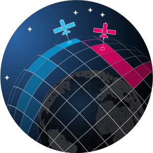

# OrbitDefender2D


 

## Overview

2D, grid-based board games inspired by the orbital domain

2D environment can be viewed as an orbital plane with objects in circular orbits

### Design Principles

*TODO*

------------

## Citation

~~> TODO: *Zenodo DOI to be added upon making repo public*

```
@inproceedings{allen2023spacegym,
  title={SpaceGym: Discrete and Differential Games in Non-Cooperative Spa
ce Operations},
  author={Allen, Ross E and Rachlin, Yaron and Ruprecht, Jessica and Loughran, Sean and Varey, Jacob and Viggh, Herbert},
  booktitle={2023 IEEE Aerospace Conference},
  pages={1--12},
  year={2023},
  organization={IEEE}
}
```

------------

## Disclaimer

DISTRIBUTION STATEMENT A. Approved for public release. Distribution is unlimited.

This material is based upon work supported by the Under Secretary of Defense for Research and Engineering under Air Force Contract No. FA8702-15-D-0001. Any opinions, findings, conclusions or recommendations expressed in this material are those of the author(s) and do not necessarily reflect the views of the Under Secretary of Defense for Research and Engineering.

© 2022 Massachusetts Institute of Technology.

Subject to FAR52.227-11 Patent Rights - Ownership by the contractor (May 2014)

SPDX-License-Identifier: MIT

The software/firmware is provided to you on an As-Is basis

Delivered to the U.S. Government with Unlimited Rights, as defined in DFARS Part 252.227-7013 or 7014 (Feb 2014). Notwithstanding any copyright notice, U.S. Government rights in this work are defined by DFARS 252.227-7013 or DFARS 252.227-7014 as detailed above. Use of this work other than as specifically authorized by the U.S. Government may violate any copyrights that exist in this work.

------------

## Installation

To install this package, run:

```bash
pip install -e .
```

For development of this package, we recommend using the conda environment defined in `environment.yml`. To create and activate this environment, run:

```bash
conda env create -f environment.yml
conda activate orbit_defender2d
```

------------

## Testing

For developers, unit and integration tests are located in the `tests/` directory and can be run with:

```bash
pytest -v
```

Note that `test_game_server.py` can sometimes fail if too many processes are running due to slow responses between game servers and clients. It is recommended that tests be run seperately with the following two commands:

```bash
pytest . --ignore=tests/test_game_server.py # run all tests except game server
pytest tests/test_game_server.py            # run game server tests
```
------------

## How to Start the Game

For more details, please see the [__Game Rules Wiki__](https://github.com/mit-ll/spacegym-od2d/wiki/Game-Rules) and access the User Guide. 

1. In a terminal window, navigate to your src folder inside the od2d_learn folder from the GitHub repository. 
2. Activate od2d_learn by typing the following command: 

```bash
conda activate od2d_learn
```
Next to your user ID in the terminal, it should now say “od2d_learn” instead of "base". 

3. Use python to start the game file that you are choosing to run. Please reference the User Guide for a comprehensive list of file names. The following command will run a Human v. AI game. 

```bash
python koth_game_rollout_CLI.py
```

------------

## Game: King Of the Hill (KOTH)

The [King of the Hill Game](https://github.com/mit-ll/spacegym-od2d/tree/master/src/orbit_defender2d/king_of_the_hill) is a balanced game of two players. Each player has a collection of satellites (referred to as "pieces" or "tokens") that they control. Satellites are seperated into categories of point-scoring tokens ("seeker") and defensive/offensive tokens ("bludger"). Each satellites can move about the board by expending fuel and can engage with satellites of the opposing agent. Each player also has a special a goal location, i.e. "hill", on which they can place their seeker to score points. The objective of the game is to score more points that your opponent. You can minimize the number of points scored by your opponent by attacking their pieces.

For comprehensive rule set, please see the [__Game Rules Wiki__](https://github.com/mit-ll/spacegym-od2d/wiki/Game-Rules)

### KOTH Tutorials

The KOTH game consists of [core game code](https://github.com/mit-ll/spacegym-od2d/blob/master/src/orbit_defender2d/king_of_the_hill/koth.py) and two interfaces for running the game. To see an example of how the core KOTH game is run (using random, yet valid, actions from each player), see [`core_random_game.py`](https://github.com/mit-ll/spacegym-od2d/blob/master/src/orbit_defender2d/king_of_the_hill/examples/core_random_game.py). This can be executed as:

```bash
python src/orbit_defender2d/king_of_the_hill/examples/core_random_game.py
```

There is a human-playable interface to the game that uses a [game server](https://github.com/mit-ll/spacegym-od2d/blob/master/src/orbit_defender2d/king_of_the_hill/game_server.py) running in python that can talk to a game clients running a Unity-based user interface (_under development, no link at this time_). For an example of running a game using the game server (with random-valid actions and python game clients as stand-ins for the Unity clients), see [`server_random_game.py`](https://github.com/mit-ll/spacegym-od2d/blob/master/src/orbit_defender2d/king_of_the_hill/examples/server_random_game.py). This can be run as:

```bash
python src/orbit_defender2d/king_of_the_hill/examples/server_random_game.py
```

There is also an AI playable that wraps the core KOTH game in a OpenAI Gym-like [environment](hhttps://github.com/mit-ll/spacegym-od2d/blob/master/src/orbit_defender2d/king_of_the_hill/examples/pettingzoo_random_game.py). To enable development of multi-agent RL algorithms we will be using a [PettingZoo](https://github.com/PettingZoo-Team/PettingZoo) environment, which is also described in this [paper](https://arxiv.org/pdf/2009.14471.pdf). For an example of the PettingZoo-wrapped KOTH game, see [`pettingzoo_random_game.py`](). This can be run as:

```bash
python src/orbit_defender2d/king_of_the_hill/examples/pettingzoo_random_game.py
```

The PettingZoo-wrapped game can be visualized based on a rendering function. For example, run

```bash
python src/orbit_defender2d/king_of_the_hill/examples/pettingzoo_random_rendered_game.py
```


### Self-Play Training with RLlib

_UNDER DEVELOPMENT_


### Playing UNITY Orbital Defender 

You can use the KOTH game engine to run the 3D Unity interface (_LINK TO BE ADDED_). To run it, follow the installation and environment instructions above. After that, in an Anaconda shell change directory to the sandbox directory, [...]\orbit_defender2d\src\orbit_defender2d\sandbox. Type the following 

```bash
conda activate orbit_defender2d
python server_for_unity.py
```

Once the server is activated you can start the 3D Unity interface and all communication will happen behind the scenes. 

#### Python-Unity JSON API

_UNDER DEVELOPMENT_

